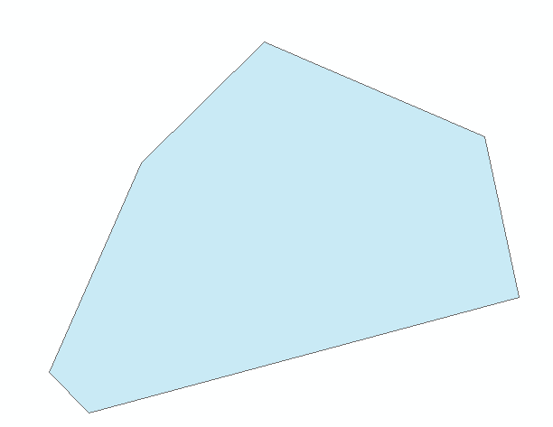

###Imagine you having geological data of many many roads,
###and you want to obtain the `geographical extent` of the roads,
###then maybe you need to `draw it out` by dragging the mouse `manually`.

###So is it possible if your computer can do it `automatically`?
###Sure!`Python` can help you do that!

You can do that step by step.

First,import the arcpy package generated by ESRI.
Then,you can use the geoprocessing tools offered by arcpy to process the geo data.

The codes are short and easy to understand.

The original data and the final result are as follows.

